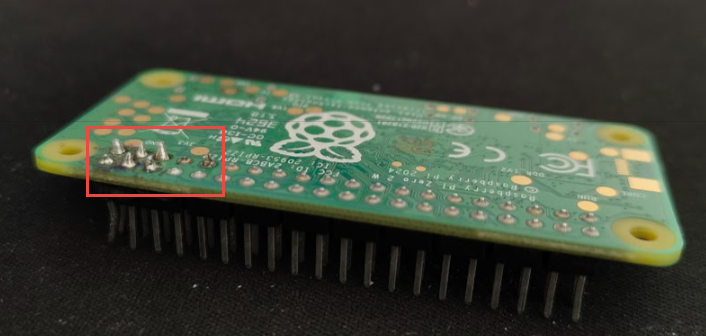

# 📸 InkyPi Photo Wall — Auto Sleep/Wake with PiSugar RTC

A battery-powered eInk photo wall that displays photos from an Immich album, automatically refreshing 5 times a day and sleeping in between to preserve battery life.

## Hardware

| Component | Model |
|---|---|
| Single Board Computer | Raspberry Pi Zero 2W |
| eInk Display | Waveshare eInk Display |
| Battery HAT | PiSugar (1200mAh or 1500mAh) |

## How It Works

```
Pi wakes up (RTC alarm fires)
       ↓
InkyPi fetches new photo from Immich
       ↓
eInk display refreshes (~60 seconds)
       ↓
Script sets next RTC alarm (3 hours later)
       ↓
Pi shuts down to save battery
       ↓
PiSugar RTC quietly counts time in background
       ↓
3 hours later → repeat forever
```

**Daily Schedule:** 7am → 10am → 1pm → 4pm → 7pm → sleep until 7am

**Battery life:** Pi is only active ~3 minutes per cycle × 5 cycles = ~15 minutes per day. Battery lasts several days between charges.

## Dependencies

- [InkyPi](https://github.com/fatihak/InkyPi) — eInk display manager with web UI
- [PiSugar Power Manager](https://github.com/PiSugar/pisugar-power-manager-rs) — battery management and RTC control
- [Immich](https://immich.app/) — self-hosted photo library

## Setup

### 1. Install InkyPi
Follow the [InkyPi installation guide](https://github.com/fatihak/InkyPi#installation).

### 2. Install PiSugar Power Manager
Follow the [PiSugar installation guide](https://github.com/PiSugar/pisugar-power-manager-rs).

### 3. Configure InkyPi
- Open InkyPi web UI at `http://inkypi.local`
- Create a playlist (e.g. `MyPlaylist`)
- Add an `image_album` plugin instance (e.g. `My Album`)
- Connect to your Immich instance and select your album

### 4. Create the Schedule Folder

```bash
mkdir -p ~/inkypi_schedule
```

### 5. Copy and Edit the Script

```bash
cp inky_refresh.sh ~/inkypi_schedule/
chmod +x ~/inkypi_schedule/inky_refresh.sh
```

Open the script and update these 3 things to match your setup:

```bash
nano ~/inkypi_schedule/inky_refresh.sh
```

**Line to update — your playlist and instance names:**
```bash
-d '{"playlist_name": "YOUR_PLAYLIST", "plugin_id": "image_album", "plugin_instance": "YOUR_INSTANCE"}'
```

**Line to update — your username in the log path:**
```bash
LOG="/home/YOUR_USERNAME/inkypi_schedule/inky_refresh.log"
```

**Line to update — your cron path:**
```bash
@reboot sleep 20 && /home/YOUR_USERNAME/inkypi_schedule/inky_refresh.sh
```

### 6. Copy the Cheatsheet

```bash
cp CHEATSHEET.txt ~/inkypi_schedule/
```

Fill in your personal details in the `YOUR INKYPI DETAILS` section at the bottom of the cheatsheet.

### 7. Set Up Auto-Run on Boot

```bash
sudo crontab -e
```

Add this line at the bottom:
```
@reboot sleep 20 && /home/YOUR_USERNAME/inkypi_schedule/inky_refresh.sh
```

### 8. Start the First Cycle

```bash
sudo reboot
```

The Pi will restart, run the script, refresh the display, set the RTC alarm, and shut down. From that point the RTC takes over automatically forever!

## Files

| File | Description |
|---|---|
| `inky_refresh.sh` | Main script — handles refresh, RTC alarm, shutdown |
| `CHEATSHEET.txt` | Quick reference for common tasks |
| `README.md` | This file |

## Useful Commands

```bash
# Check logs
cat ~/inkypi_schedule/inky_refresh.log

# Check battery level
echo "get battery" | nc -q 0 127.0.0.1 8423

# Check RTC alarm status
echo "get rtc_alarm_enabled" | nc -q 0 127.0.0.1 8423

# Disable RTC alarm (stop auto cycle)
echo "rtc_alarm_disable" | nc -q 0 127.0.0.1 8423

# Force display refresh manually
curl -s -X POST http://localhost:80/display_plugin_instance \
  -H "Content-Type: application/json" \
  -d '{"playlist_name": "YOUR_PLAYLIST", "plugin_id": "image_album", "plugin_instance": "YOUR_INSTANCE"}'
```

## Troubleshooting

**Pi not waking up at scheduled time**
- Check RTC alarm is enabled: `echo "get rtc_alarm_enabled" | nc -q 0 127.0.0.1 8423`
- Make sure PiSugar power switch is in ON position
- Check logs to confirm last cycle set the alarm correctly

**Display not refreshing**
- Check InkyPi service: `systemctl status inkypi.service`
- Check logs: `cat ~/inkypi_schedule/inky_refresh.log`
- Verify playlist and instance names match exactly in the script

**Pi keeps waking up unexpectedly**
- Disable alarm: `echo "rtc_alarm_disable" | nc -q 0 127.0.0.1 8423`
- Rename script to stop it running on boot: `mv ~/inkypi_schedule/inky_refresh.sh ~/inkypi_schedule/inky_refresh.sh.bak`

**After battery dies fully**
- Charge battery
- Press PiSugar button once to wake Pi manually
- Automatic cycle resumes from there

**Pi Zero 2 WH not powering from PiSugar 3**
When using a Raspberry Pi Zero 2 WH (factory-soldered headers) with PiSugar 3, the pogo pins may not make proper contact with the pads underneath the Pi.

**Fix:** Add a slight flex/extension to the pogo pins so they press firmly against the Pi’s underside pads.  
  After this adjustment, the connection was stable, and the issue was resolved.



  ⚠️ Do not add spacers between the Pi and PiSugar, as this increases the gap.  
  ⚠️ Always turn off or disconnect the battery before mounting.

## Recommended Display Settings

In InkyPi Web UI → Settings:

| Setting | Value |
|---|---|
| Saturation | 1.5 |
| Contrast | 1.2 |
| Sharpness | 1.3 |
| Brightness | 1.1 |
